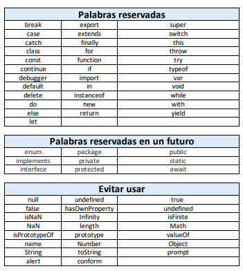

# PALABRAS RESERVADAS JAVASCRIPT

> Web para validar palabras reservadas:
https://mothereff.in/js-variables#%E0%B2%A0%5f%E0%B2%A0

### Convenciones de nombres de variables

- Los nombres deben estar formados por letras (a .. z, A .. Z) y dígitos (0 .. 9) y guión bajo _. Evitar el uso de caracteres especiales (<*^¨=?) o internacionales ($£àêß).

- Las variables deben comenzar con una letra minúscula y las variables globales con mayúscula.

- Se deben evitar nombres de una sola letra. Debemos usar nombres descriptivos que ayuden a entender el código. Nunca debemos usar nombres que se puedan confundir con palabras reservadas del lenguaje como break, const, else, new, entre otras.